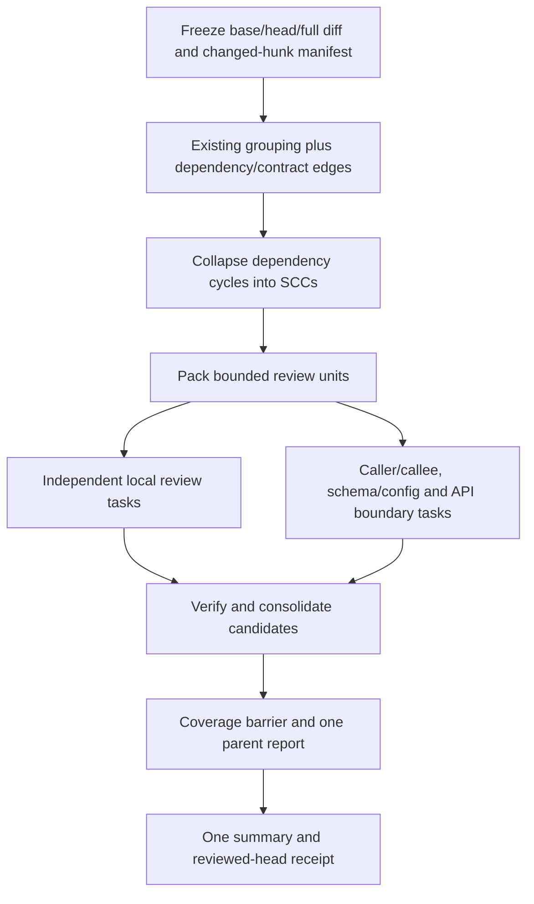
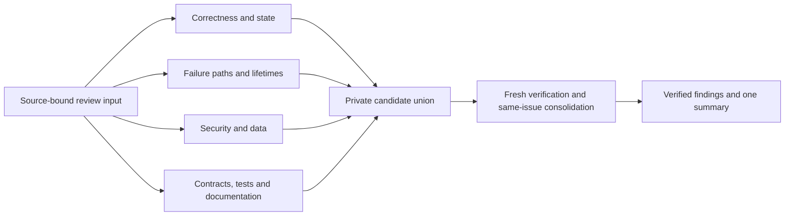

# Martian benchmark: findings, corrections, and improvements

Research and implementation note, 2026-09-30. The baseline used
`openai/gpt-6-luna-pro`, thinking `high`, and three attempts scored with the
Martian runner at `e616e849755441da38f18bf3adba2c9583b03803` through OpenRouter
using `anthropic/claude-sonnet-4.5` for extraction, deduplication, and judging.
The published comparison data is that commit's
`offline/analysis/benchmark_dashboard.json`, not a claim about today's live
leaderboard. Baseline artifacts currently live in the ignored
`.worktrees/martian-baseline/.eval/martian/` directory, not in this document.

## Baseline placement

Core profile, Sonnet 4.5 judge, F1 ranking with our three-attempt mean inserted:

| rank | tool | precision % | recall % | F1 % |
|---:|---|---:|---:|---:|
| 1 | cubic-v2 | 56.5 | 60.8 | 58.5 |
| 2 | qodo-extended-v2 | 56.2 | 57.0 | 56.6 |
| 3 | augment | 52.4 | 61.4 | 56.6 |
| 17 | claude-code | 36.5 | 41.1 | 38.7 |
| 18 | claude | 38.3 | 36.1 | 37.1 |
| **19** | **unreal-review** | **37.1** | **32.9** | **34.8** |
| 20 | codeant-v2 | 32.4 | 34.8 | 33.5 |

This is a self-measured comparison, not a Martian-certified ranking.
It weights precision and recall equally (F1). The dashboard's default beta
is 2, which weights recall more heavily. Comparing our Sonnet scores against
other tools' Opus or GPT scores is a sensitivity illustration, not a valid
same-judge ranking. We have not yet scored our outputs with those two judges.

### What the baseline actually establishes

- **Repeated attempts disagree about individual goldens.** Of 173 goldens in
  the all profile, 101 were found in none of three attempts, 18 in one, 9 in
  two, and 45 in all three. Average all-profile recall is 32.95%, and the
  three-attempt union is 41.62%. Critical+High recall rises from an average
  43.94% to a union of 56.06%. A union does not establish precision or F1 for
  an actual merged review. Three attempts do not prove that the never-found
  issues are impossible to find by further sampling.
- **There is one infrastructure coverage failure.** `sentry-greptile-5` is
  252,701 unified-diff bytes, 106 changed files, and 3,293 added/deleted lines.
  All three attempts refused it before calling the agent. Its six goldens
  remained in the denominator. Only 49 of 50 cases completed per attempt.
- **File count did not correlate with lower recall in this sample.** Pooled
  all-profile recall was 29.3% for <=10 files, 29.9% for 11-30, and 47.9% for
  >30. These buckets mix languages, defect categories, and PR difficulty.
  They do not prove that large contexts are safe or that increasing the byte
  limit would preserve quality. An oversized PR is not evidence for the
  capabilities of runs we never executed.
- **Some reviews were consistently empty despite goldens.**
  `grafana-76186`, `sentry-80528`, and `calcom-22345` had empty findings and
  complete clean summaries in all attempts. This deserves tracing whether
  the model missed, rejected, or disagreed with each issue. We do not have
  evidence that the prompt's evidence rule caused those misses.
- **Low-severity and certain categories had lower measured recall.** Low
  recall was 18.1%, `test_gap` 0%, `perf` 16.7%, `style` 10%, whereas
  concurrency was 54.8% and API 51.3%. The sample contains only four
  `test_gap` and six `perf` goldens. Prompt-lens explanations are hypotheses,
  not controlled experimental results.
- **Volume needs three distinct measurements.** Raw finding counts were
  93/96/84. Martian extracted 170/168/155 candidates before profile
  accounting, an average of 3.29 candidates per PR. Core TP+FP counts were
  145/149/128 and are not literal candidate totals: TP counts matched goldens,
  profiles ignore some matches, and extraction can split one finding into
  several candidates. The original claim that our volume already matched
  the leaders used the wrong denominator and is withdrawn.

## 1. OpenRouter model identity

**Yes: an OpenRouter request routed to Anthropic's same snapshot uses the
same model.** A different public slug or results-directory name is not a
model mismatch. On 2026-09-30 the [public endpoint metadata][or-endpoints]
for `anthropic/claude-sonnet-4.5` lists the Anthropic endpoint as
`anthropic/claude-4.5-sonnet-20250929`, consistent with Martian's dated
Sonnet 4.5 snapshot. Moving to a different endpoint is not necessary merely
to rename the model. This corrects the earlier recommendation.

For future reproducibility, retain:

1. Runner commit, golden-data revision, all steps 2/2.5/3, profile, beta,
   full case denominator, source SHAs, extraction/dedup inputs and outputs.
2. The requested model slug, endpoint metadata at run time, actual provider
   reported by OpenRouter, temperature (runner uses 0), reasoning and output
   parameters. Today's metadata cannot prove which route historical calls
   used if those responses were not retained.
3. If Anthropic-only routing is desired, use the runner's OpenAI client's
   request `extra_body` to set:

   ```json
   {"provider":{"only":["anthropic"],"allow_fallbacks":false,"require_parameters":true}}
   ```

   These are OpenRouter's documented [provider-routing settings][or-routing].
   The current pinned runner does not expose this request body through an
   environment variable. Add explicit request configuration or use an
   account/key provider restriction, then retain that configuration.
4. Re-score our saved reviews if we want Opus/GPT judge comparisons, not
   because equivalent Sonnet names alone invalidate our current score.

Same model does not mean bit-identical output. Re-judging a sample measures
sensitivity and pipeline compatibility, but a one-point F1 tolerance on two
tools cannot establish statistical equivalence. No verified runner-scoring
cost estimate is available. Do not promise that 10k judge calls cost only a
few dollars.

## 2. `group` provided decomposition; aggregate execution is now implemented

`unreal-review group` selects the same git range and prints pathspec groups.
`internal/review/group.go` already combines directories, stem companions,
implementation/tests, lockfiles, locales, headers, and selected Go import
relationships. `group_import.go` supplies Go-specific dependency edges.

It does **not** execute group reviews, accumulate a parent report, or ensure
completion of all groups before issuing a reviewed-head receipt. Limits are
25 files and 2,000 changed lines per group with a singleton exemption.
Neither limit guarantees <=200,000 actual diff bytes. A single huge file
cannot be split by pathspec. The Bend model's `CappedTail` allows that
singleton, so claiming every group is hard-bounded would misstate the proof.

### Primary-source research

| source | technique | evidence and limits |
|---|---|---|
| [Anthropic public review plugin][cc-plugin] | independent reviewers, candidate validation and filtering | concrete open implementation of parallel review followed by validation, not a measured gain for our harness |
| [Anthropic production Code Review][claude-review] | parallel search, verification, deduplication, effort scaled by complexity | vendor-reported production observations, not an exposed dependency scheduler or proof that four reviewers are optimal |
| [ClusterChanges][clusterchanges] | related-change clustering by syntactic/semantic information | supports decomposing mixed-purpose changes, not arbitrary byte slicing |
| [ChgCutter][chgcutter] | program-dependence graph partitions | reports partition accuracy on a limited corpus, not AI-review precision/recall |
| [Controlled human study][human-study] | decomposed rather than bundled review tasks | fewer wrongly reported issues, no observed increase in defects found in that study |

### Recommended large-PR design: dependency groups plus boundary reviews



Key design choices:

- File-dependency edges are **context relationships**, not automatically
  scheduler dependencies. Read-only reviews over a frozen workspace can run
  concurrently. The execution DAG requires an edge when one task consumes
  another's artifact, such as verification after discovery.
- Collapse strongly connected components for planning, but do not merge every
  connected file into an unbounded prompt. A giant SCC still needs bounded
  units and explicit cross-unit contract tasks.
- Start with existing deterministic groups. Extend relationships
  incrementally beyond Go imports (caller/API boundaries, shared DTO/schema,
  migrations and configuration) instead of deploying an unvalidated graph
  parser for every language at once. Retain edge provenance and conservative
  fallbacks when relationship resolution is incomplete.
- Budget actual serialized prompts, including PR context, boundaries, and
  tool outputs, not just file counts or numstat lines. Token limits depend on
  the model. Oversized singleton files need hunk or syntax-aware units with
  old/new line maps, never silent truncation or arbitrary byte cuts.
- Every changed hunk has exactly one primary owner. Context can overlap.
  Tests belong with their implementation where possible. Track coverage of
  local units, inter-unit edges, verifier batches, and binary/deleted/renamed
  files, including explicitly unsupported scopes.
- Keep all tasks tied to the full source SHA plus deterministic scope/plan
  digests. Completed tasks survive cancellation and resume. Failed or
  unreviewed tasks must never become a clean complete parent review.
- Verification batches can run per unit/candidate, followed by a consolidation
  task for duplicates and a final boundary check. One giant verifier prompt
  is not a scalable large-PR solution.
- Publish only the parent. Rendering individual groups can incorrectly mark
  the whole head reviewed after a subset finishes and skip subsequent work.

This design is now implemented as automatic bounded aggregate execution for
diffs above 200,000 bytes and as `--decompose` for smaller ranges. Local tasks
own the entire selected unified diff exactly once by byte span. Oversized hunks
are split only at whole-line boundaries with rewritten original old/new hunk
coordinates and repeated file metadata as context. Every local gets a boundary
pass with the full changed-scope manifest; known cross-scope Go import edges add
explicit pairs. Other language dependencies remain conservative discovery, not
a claimed complete semantic graph or SCC analysis.

Task prompts are bounded at 120,000 serialized bytes, with construction reserving
space for executor instructions. An indivisible source line, PR/source context,
or full scope manifest that cannot fit is rejected explicitly. Private task
findings are verified in bounded batches, followed by a bounded multi-round
consolidation. Both task completion and verification coverage must exactly match
the plan digest before the single root report completes. The source diff is
re-read against the originally resolved range before publication. Adapter state,
cost receipts and artifacts survive interruption; unknown in-flight provider
usage remains unrecoverable.

The public findings schema is unchanged, so planning/coverage stays inside the
Agent adapter. The product law was deliberately changed: unplanned oversized
input remains refused, while a valid bounded full-ownership plan may execute.
`LAWS.bend`, `spec/plan.bend`, `spec/checkpoint.bend` and `PROOF.bend` model the
new conditions without claiming Go equivalence or semantic bug truth.

### Large Martian execution pilot, 2026-09-30

The first live run used the committed `0f43d2a` build on
`sentry-greptile-5`, the 252,701-byte / 106-file case that the historical
baseline refused. Automatic planning started successfully, kept the public root
running and private, and durably recorded $0.21386122 across 86 requests. The
15-minute invocation completed 13 tasks, then paused without publishing a clean
receipt or findings.

That is reachability evidence, not a practical large-PR quality result. The plan
had 152 local and boundary task stages because the first implementation flushed
at every locality group. The follow-up planner now packs whole small locality
groups together up to the prompt budget, never splits a group that fits alone,
and retains fragment splitting for a group that is itself oversized. A 40-group
320KB regression now produces only a few near-cap local tasks while preserving
exact byte ownership and linked-file locality.

The pilot also exposed an eval-only continuation defect. Martian fixture
`commit-tree` calls inherited current timestamps and `RunMartian` always set
`Fresh`, so another invocation could not reuse its checkpoint. Synthetic commits
now use fixed author/committer dates and eval reuses an existing output. Local Git
regressions prove stable synthetic SHAs and that evaluation options do not force
a fresh review.

### OpenRouter batching and decomposition diagnosis, 2026-09-30

The packed Sentry plan is 252,701 bytes across 106 files at exact source SHA
`b458...`. It has three local prompts of 28,551, 117,771, and 118,692 bytes and
three boundary prompts of approximately 49,421-49,441 bytes. In the measured
live run, `Parallel=2` let active children reach 17-22 model turns and 62/81
unique Bash commands before the first completion at about 7.5 minutes. The
observed bottleneck is therefore unconstrained agent exploration more than
request submission. This is diagnosis only; it is not a live-success claim.

OpenRouter's [Batch API][or-batch] is asynchronous, has a 24-hour completion
window, and uses one provider. Its roughly 50% cost reduction is attractive for
non-interactive CI, but it does not group requests by `session_id` and does not
fit the current interactive, multi-turn tool harness. For synchronous agents,
OpenRouter recommends a stable session ID and static prefix for [KV prompt
caching][or-caching]. The unreal-agent OpenRouter client already supplies
`x-session-id` and `cache_control`, and earlier measurements showed high cached
token counts.

Routing can still tune latency explicitly. OpenRouter's [`:nitro` routing][or-nitro]
sorts providers by throughput, while provider sorting and thresholds can admit
faster or priority-tier routes. These choices may cost more and must remain an
explicit model/routing selection, not a hidden semantic change. The
[limits documentation][or-limits] also warns that parallel paid requests can
exhaust the in-flight spending budget; clients must honor `402 Retry-After` and
`429` responses.

The resulting architecture decision is bounded synchronous fanout: allow four
parallel workers only for `single`, retain two for focused nested fanout, cap
child Bash exploration, and preserve durable receipts and resume. A batch
backend remains a future replaceable implementation of the `Agent` seam.

### Bounded strategy comparison, 2026-09-30

A paired attempt on `calcom-10600` used the same reviewer model and Anthropic
Sonnet 4.5 judge route. `single` completed in 313.45 seconds with three findings,
two of four core goldens matched, $0.05332178 review cost and 15 requests.
`focused` completed all four durable discovery stages but did not finish its
verifier inside the 10-minute cap. Those stages cost $0.163539925 across 37
requests and correctly left the public root running with no hypotheses.

Therefore this attempt cannot compare precision/recall. It does establish a
lower bound: focused spent 3.07x the single review cost and 2.47x the requests,
with more than 1.9x the latency and no publishable result. This reinforces
keeping `single` as the default. The second selected case was not reached by the
focused arm. Its single-arm judge response was malformed, another reason not to
turn this tiny exploratory run into a leaderboard claim. Comparable Martian
scores still require the pinned extraction, deduplication and step-3 runner.

## 3. Implemented recall experiment

The single-review prompt now encourages systematic coverage, investigating
uncertain premises before abandoning them, comparison of refactors with the
old implementation, and evidence-backed minor notes. It explicitly forbids
publishing unsupported allegations at any severity. We did not weaken the
public evidence standard.

The opt-in `--strategy focused` agent implements this execution DAG:



Each discovery node has a separate session and work file. Candidates are
private hypotheses, not published findings. The verifier must inspect code,
reject unconfirmed premises, retain candidate identities, and consolidate
only the same underlying issue. Line overlap alone is not deduplication.
No verifier-generated finding outside the candidate identity/location set is
accepted. A concrete small issue can be `note`, but severity does not excuse
missing evidence. **Notes are currently posted by the GitHub renderer**,
so allowing more notes is not noise-free. No severity filter was added.

The DAG lives behind `review.Agent`. Its stage manifest and continuation
mapping remain adapter-owned, leaving findings-v1 unchanged. Resume validates
configuration and dependencies, skips completed stages, and reconciles staged
cost against `AgentRequest.PriorCost` in the parent checkpoint. Missing
adapter state or changed settings requires a fresh review. Timeout covers
the whole focused invocation, and shared logs serialize writes.

Use:

```sh
unreal-review run --strategy focused --model openai/gpt-6-luna-pro --out findings.jsonl
unreal-review eval --strategy focused --model openai/gpt-6-luna-pro \
  --cases race,wrap-break,once-failure,clean
unreal-review eval --corpus martian --strategy focused --parallel 2 \
  --judge-model anthropic/claude-sonnet-4.5 --model openai/gpt-6-luna-pro
```

`single` remains the default. Focused reviews spend more model requests and
can have longer latency. `--parallel` controls cases, so two focused cases
can run up to eight discovery agents concurrently. The focused verifier's
candidate budget is explicitly bounded rather than truncated. When focused is
selected for a decomposed review, each bounded task runs the four focused
discovery lenses, while the enclosing aggregate pipeline performs the only
candidate verification. This avoids an unbounded nested verifier but multiplies
cost, so `single` remains the practical default for automatic large-PR plans.

### Live planted pilot, 2026-09-30

A small real OpenRouter pilot used `openai/gpt-6-luna-pro`, thinking `high`.
The single run exercised all 11 planted cases with a 90-second per-case
limit: 10 completed, 9/10 goldens matched, 10 findings and one benchmark
extra, $0.03829457 across 46 requests. `body-leak` paused at the deadline.
This run used the broader single prompt, not a controlled old-prompt baseline.

The focused comparison selected three seeded defects and a clean control.
Its first invocation had a two-minute whole-DAG deadline. Race and once-failure
paused without publishing hypotheses; each then completed after one additional
two-minute continuation. The table uses final cumulative cost and requests,
not just the successful continuation's incremental usage:

| case | single findings | focused findings | single USD / requests | focused USD / requests | focused first invocation |
|---|---:|---:|---:|---:|---|
| race | 1 | 1 | 0.002920990 / 5 | 0.023929800 / 25 | paused at 120s, then resumed |
| wrap-break | 1 | 1 | 0.003301710 / 4 | 0.019213595 / 22 | complete in 90s |
| once-failure | 2 | 3 | 0.007001470 / 7 | 0.034177545 / 26 | paused at 120s, then resumed |
| clean | 0 | 0 | 0.002237760 / 3 | 0.015820400 / 18 | complete in 68s |
| **paired total** | **4** | **5** | **0.015461930 / 19** | **0.093141340 / 91** | **2/4 initially complete, 4/4 after resume** |

Both strategies contained all three seeded defects after continuation, and
both left the clean control clean. **No seeded-defect recall gain was observed.**
Focused cost 6.02 times the paired single run and made 4.79 times as many
requests. It must remain opt-in, not a presumed improvement.

For once-failure, both reported permanently cached dial failure and ignored
subsequent addresses. Focused additionally reported returning a closed cached
connection after `Conn.Close`; the fixture exposes that behavior. The sparse
one-golden case therefore has one single-pass benchmark extra and two focused
extras, not demonstrated false accusations. Its overlapping-line matcher can
also consume the address warning before the actual dial-failure error, so
severity agreement is not issue-identity validation here. All three bodies
and the implementation were inspected rather than equating overlap with truth.

The live continuation exposed a pre-existing fixture problem: generated
`findings.jsonl` and `.work` files were untracked within the source workspace
and changed its fingerprint. Ignoring only those eval-owned artifacts in
`.git/info/exclude` restored the original diff. Both continuations retained
their root IDs/source SHAs and accumulated cost correctly. The implementation
now excludes those fixture outputs before the base commit and includes a
pause/resume regression test. Working-tree users should keep output outside
the selected source or ignore it before starting.

Captured commands, stdout, stderr, exit status and final JSONL live locally
under `$JCODE_SCRATCH_DIR/unreal-review-focused-pilot/{evidence,scratch}/pilot/`.
The compiled review logic corresponds to `b2d08c1`; pilot runs used its
pre-commit worktree based on `4df8087`, before the fixture-hardening follow-up.
Different deadlines, continuations, one attempt, and tiny hand-planted Go
examples make this a functionality/cost pilot, not a controlled statistical
quality comparison or a new Martian score. Final `make check`, `make canary`,
and race tests passed, including compiled loopback-provider workflows.

### Measurement before changing the default

1. Compare single and focused on the planted corpus, including the clean
   control. Record completion, precision/recall, cost, requests, and time.
2. Run repeated paired attempts on the full Martian set with fixed judge and
   runner pipeline. Keep all 50 cases in the denominator. Do not expose
   goldens to discovery or verification.
3. Separate ablations: broader single prompt, focused discovery without
   consolidation, and focused discovery with verification. The implementation
   ships the safe verified version, not an unverified publishing mode.
4. Report mean/spread, paired per-PR differences and per-golden hit frequency.
   Bootstrap at PR level, not independent comments or repeated attempts.
   Account for variation caused by extraction/judging as well as reviewing.
5. Audit unmatched findings and rejected candidates. Sparse goldens make
   benchmark "extra" different from a demonstrated false accusation.
6. Use unseen regressions and live dogfood to guard against tuning to the
   fixed 50 PRs. Promote focused to default only after observed quality and
   acceptable cost, not because multi-agent review is fashionable.

No improvement in full-benchmark scores is established by implementation or
mock-provider tests alone. `eval --attempts N`, a reusable repeated-run
analysis/plot tool, broader repeated Martian remeasurement, richer dependency
resolution beyond Go imports, and measured scheduler tuning remain follow-up
work. Aggregate bounded large-PR execution itself is implemented.
Official leaderboard inclusion is not a blocker for publishing self-measured
results with these qualifications.

[or-endpoints]: https://openrouter.ai/api/v1/models/anthropic/claude-sonnet-4.5/endpoints
[or-routing]: https://openrouter.ai/docs/features/provider-routing
[or-batch]: https://openrouter.ai/docs/batch-quickstart
[or-caching]: https://openrouter.ai/docs/features/prompt-caching
[or-nitro]: https://openrouter.ai/docs/features/provider-routing#nitro
[or-limits]: https://openrouter.ai/docs/api-reference/limits
[cc-plugin]: https://github.com/anthropics/claude-code/blob/main/plugins/code-review/commands/code-review.md
[claude-review]: https://claude.com/blog/code-review
[clusterchanges]: https://www.microsoft.com/en-us/research/publication/helping-developers-help-themselves-automatic-decomposition-of-code-review-changes/
[chgcutter]: https://link.springer.com/article/10.1007/s11390-019-1917-9
[human-study]: https://arxiv.org/abs/1805.10978
